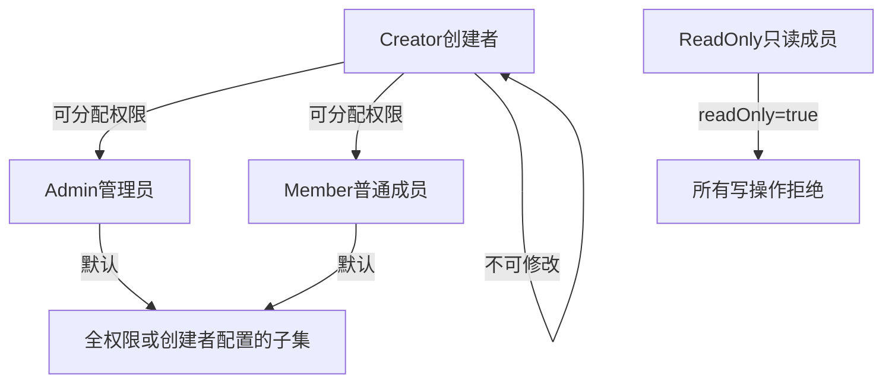
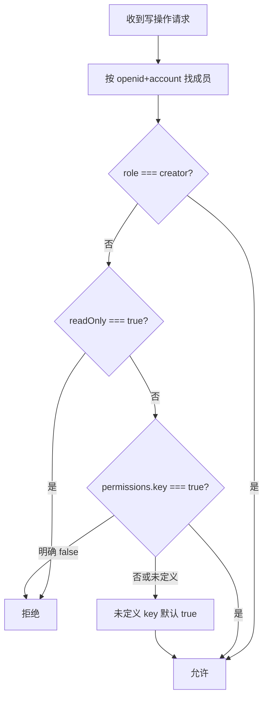

# 家庭成员细粒度权限 — 需求详情与实施方案

## 1. 背景与目标

### 现状
- 权限模型为二元：`families.members[].readOnly`（true = 只读，false/未设 = 全功能）
- 仅 **家庭创建者**（`role === 'creator'`）可在 [pages/me/me.wxml](pages/me/me.wxml) 设置只读
- 写操作校验分散在 **12+ 云函数**，前端仅 [pages/index/index.wxml](pages/index/index.wxml) 和 [pages/add/add.wxml](pages/add/add.wxml) 展示只读横幅，**未禁用按钮**（依赖后端拦截）

### 目标
- 保留 `readOnly` 及现有「设为只读 / 取消只读」流程
- 创建者可对任意 **普通成员**（`role === 'member'` 或 `'admin'`，不可改 creator）逐项配置功能权限
- **`readOnly === true` 时，细粒度权限全部无效**（你已确认）
- 前端 UI + 云函数 **双重校验**

---

## 2. 角色与谁能做什么



| 角色 | 可被分配权限 | 可分配他人权限 | readOnly 可被设 |
|------|-------------|---------------|----------------|
| creator | 否（始终全权限） | 是 | 否 |
| admin | 是 | 否 | 是 |
| member | 是 | 否 | 是 |

> 注：当前代码中 `admin` 与 `member` 在业务权限上无区别，仅展示标签不同；本需求不改变角色体系，仅扩展成员级功能开关。

---

## 3. 权限项定义（V1 建议范围）

按现有云函数边界分组，避免过细导致 UI 臃肿：

| 权限 Key | 中文名 | 涵盖操作 | 对应云函数 |
|----------|--------|----------|-----------|
| `checkin` | 打卡 | 打卡、取消打卡、完成打卡 | `checkinHomework`, `cancelCheckin`, `completeHomework` |
| `homework` | 作业管理 | 添加、编辑、删除、复制作业 | `addHomework`, `updateHomework`, `deleteHomework`, `copyHomework` |
| `subjects` | 科目管理 | 增删改科目 | `manageSubjects` |
| `children` | 孩子管理 | 添加、编辑、删除孩子（**不含** list/switch） | `manageChildren`（非 list/switch） |
| `rewards` | 积分奖励 | 奖励/惩罚配置、违规处理 | `manageRewards` |
| `exchange` | 积分兑换 | 兑换奖励 | `exchangeReward` |
| `ocr` | OCR 识别 | 图片识别导入作业 | `ocrBaidu`, `ocrGeneral` |

**不在 V1 细粒度范围内的操作**（仍仅 creator 可执行，与现有一致）：
- 家庭管理：邀请码、改名、移除成员、设只读/隐藏、解散家庭
- 账号注销：`deleteAccount`（建议继续仅非 readOnly 且保留 creator 特殊逻辑）

**始终允许（只读成员也可用）**：
- 查看：作业列表、打卡记录、积分记录、切换孩子/账号
- `manageChildren` 的 `list` / `switch`

---

## 4. 数据模型

### 4.1 `families.members[]` 扩展

```javascript
{
  openid: "...",
  account: "...",
  role: "member",       // creator | admin | member
  readOnly: false,      // 保留；true 时忽略 permissions
  hidden: false,
  permissions: {        // 新增；仅 readOnly=false 时生效
    checkin: true,
    homework: true,
    subjects: true,
    children: true,
    rewards: true,
    exchange: true,
    ocr: true
  }
}
```

### 4.2 默认值与兼容策略

| 场景 | 行为 |
|------|------|
| 老成员无 `permissions` 字段 | 视为 **全部 true**（与当前非 readOnly 行为一致） |
| `readOnly === true` | **忽略** `permissions`，等同全部 false |
| 新加入成员 | 默认 `permissions` 全 true |
| 创建者 | 不存 `permissions`，代码层始终放行 |

### 4.3 `users` 表同步（可选但建议）

与现有 `familyReadOnly` 同步模式一致，新增 `familyPermissions` 快照，供 [cloudfunctions/getUserInfo/index.js](cloudfunctions/getUserInfo/index.js) 返回给前端做 UI 禁用。** enforcement 仍以 `families.members` 为准**。

---

## 5. 权限判定逻辑（核心规则）



**判定函数**（建议新建共享模块）：
- 小程序端：[utils/permissions.js](utils/permissions.js)（新建）
- 云函数端：[cloudfunctions/common/permissions.js](cloudfunctions/common/permissions.js)（新建，各云函数 require；或复制到各函数目录以符合微信云函数部署习惯）

```javascript
function canPerform(member, permissionKey) {
  if (!member) return false;
  if (member.role === 'creator') return true;
  if (member.readOnly === true) return false;
  const perms = member.permissions;
  if (!perms) return true; // 老数据兼容
  if (perms[permissionKey] === false) return false;
  return true; // 未显式 false 则允许
}
```

---

## 6. 后端改造清单

### 6.1 [cloudfunctions/manageFamily/index.js](cloudfunctions/manageFamily/index.js)

新增 action：`setMemberPermissions`

- **入参**：`{ memberOpenid, memberAccount, permissions, account }`
- **校验**：调用方非 readOnly + role 为 creator；目标非 creator
- **效果**：更新 `members[].permissions`；同步 `users.familyPermissions`
- **保留**：现有 `setMemberReadOnly` 不变；设 readOnly=true 时 **不必清空** permissions（便于取消只读后恢复）

### 6.2 各云函数改造（Pattern A 替换）

将现有 `if (currentMember.readOnly)` 改为 `if (!canPerform(currentMember, 'xxx'))`：

| 云函数 | permissionKey |
|--------|---------------|
| `checkinHomework`, `cancelCheckin`, `completeHomework` | `checkin` |
| `addHomework`, `updateHomework`, `deleteHomework`, `copyHomework` | `homework` |
| `manageSubjects` | `subjects` |
| `manageChildren`（add/update/delete） | `children` |
| `manageRewards` | `rewards` |
| `exchangeReward` | `exchange` |
| `ocrBaidu`, `ocrGeneral` | `ocr`（并修复 openid-only 匹配，统一为 openid+account） |

**错误文案示例**：`您没有打卡权限` / `您没有作业管理权限`（替代笼统的「只读权限」）

### 6.3 已知缺口一并修复（建议纳入 V1）

- [cloudfunctions/manageFamily/index.js](cloudfunctions/manageFamily/index.js) `addSameOpenIdMember` 补充 readOnly 检查
- OCR 函数改为 openid + account 匹配

---

## 7. 前端改造

### 7.1 管理 UI — [pages/me/me.wxml](pages/me/me.wxml) + [pages/me/me.js](pages/me/me.js)

在现有「设为只读 / 隐藏 / 移除」旁增加 **「权限设置」** 入口（仅 creator 可见，目标非 creator）：

- 弹窗/子页展示 7 项 Switch
- `readOnly === true` 时：权限项 **置灰禁用**，提示「请先取消只读」
- 保存调用 `manageFamily` → `setMemberPermissions`
- 成员列表 badge：只读仍显示「只读」；若部分权限关闭且非 readOnly，显示「受限」

### 7.2 各页面 UI 拦截（与后端一致）

| 页面 | 改造 |
|------|------|
| [pages/index/index.js](pages/index/index.js) | 从 `getUserInfo` 读取 `permissions`；打卡/复制/编辑/添加按钮按 key 禁用 |
| [pages/add/add.js](pages/add/add.js) | 表单/OCR/删除按 `homework`/`ocr` 禁用 |
| [pages/rewards/rewards.js](pages/rewards/rewards.js) | 新增权限判断；兑换/管理按钮按 `exchange`/`rewards` 禁用 |
| [pages/checkin/checkin.js](pages/checkin/checkin.js) | 新增 `checkin` 权限判断 |
| [pages/accounts/accounts.wxml](pages/accounts/accounts.wxml) | 可选：展示「受限」badge |

**横幅文案升级**：
- readOnly：「您只有只读权限，只能查看数据」
- 部分权限：「您没有 XX 权限」（按场景）

### 7.3 [cloudfunctions/getUserInfo/index.js](cloudfunctions/getUserInfo/index.js)

返回当前用户的 `permissions` 与 `readOnly`，供各页面统一使用。

---

## 8. 用户故事与验收标准

### 用户故事

1. **作为家庭创建者**，我希望为某成员单独开放「打卡」但关闭「作业管理」，以便孩子自己打卡但由家长布置作业。
2. **作为家庭创建者**，我希望保留「设为只读」一键全关，且只读优先级高于细粒度设置。
3. **作为被限制的成员**，我希望在无权限的操作入口被禁用，并看到明确提示，而不是操作失败后才报错。
4. **作为老用户**，升级后行为与之前一致（非 readOnly 成员默认全权限）。

### 验收标准

- [ ] creator 可为 member/admin 配置 7 项权限；不可改 creator
- [ ] readOnly=true 时，无论 permissions 如何，所有写操作均被拒绝
- [ ] readOnly=false 且某 key=false 时，对应云函数返回失败，前端按钮禁用
- [ ] 无 `permissions` 字段的老成员行为不变（全功能）
- [ ] 取消只读后，之前保存的 permissions 仍然生效
- [ ] OCR 多账号场景权限判断正确

---

## 9. 分阶段实施计划

### 阶段 1：基础架构（优先）
- 新建 `permissions.js`（utils + 云函数公共模块）
- `manageFamily` 新增 `setMemberPermissions`
- `getUserInfo` 返回 permissions
- 数据兼容：无字段 = 全 true

### 阶段 2：云函数批量改造
- 12 个云函数接入 `canPerform`
- 修复 OCR / addSameOpenIdMember 缺口
- 部署全部云函数

### 阶段 3：管理端 UI
- `me` 页权限设置弹窗
- 成员列表 badge（只读 / 受限）

### 阶段 4：业务页面 UI 拦截
- index / add / rewards / checkin 按钮禁用与提示
- 端到端测试

---

## 10. 后续扩展（V2，不在本次范围）

- 权限模板：「仅打卡」「仅查看+兑换」等快捷预设
- `admin` 角色可代 creator 分配权限
- 操作审计日志（谁改了谁的权限）
- 更细拆分：homework 拆为 add / edit / delete

---

## 11. 推荐实施方式（Cursor 模式）

1. **Plan 模式**（当前）：确认本需求文档
2. **Agent 模式**：按阶段 1→4 依次执行，每阶段部署云函数并真机验证
3. **不建议 Multitask 并行**：云函数公共模块需先定稿，否则易返工
