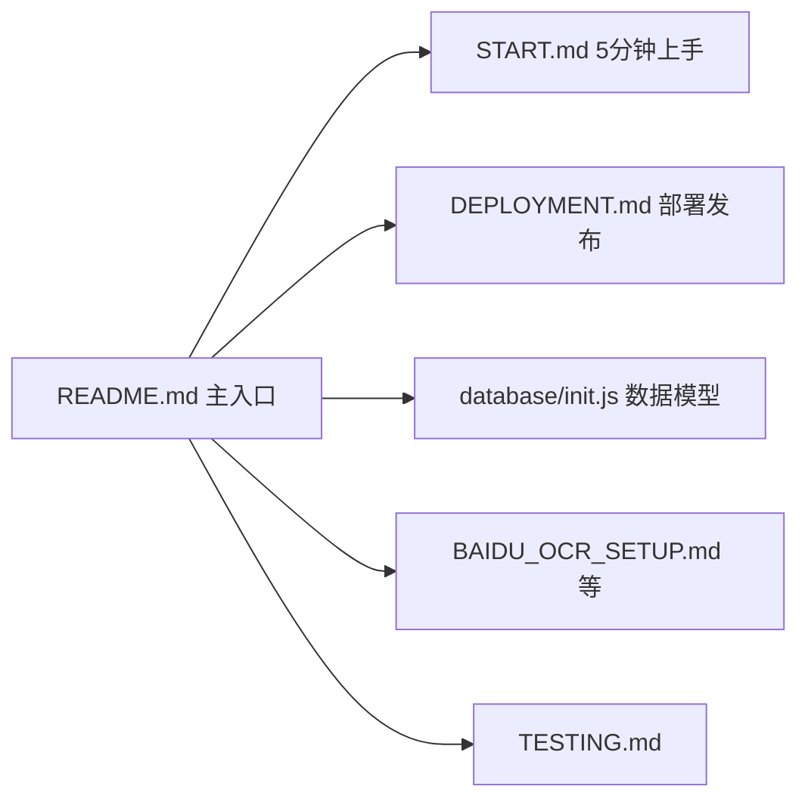
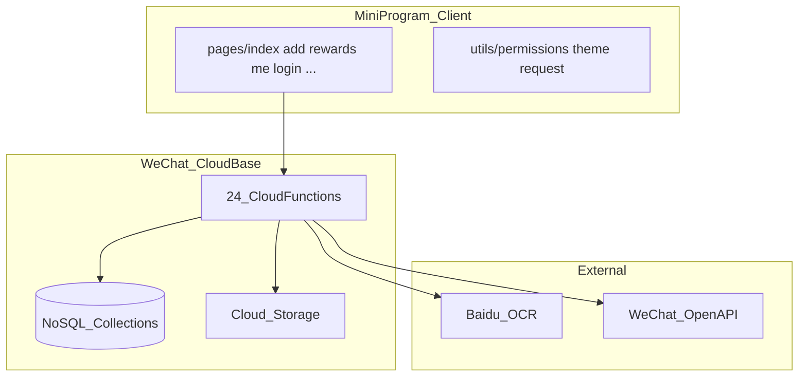

# DoJournal 开源文档全面刷新计划

## 现状问题

当前 [README.md](README.md) 与代码严重脱节，开源者按文档操作会失败：

| 文档描述 | 实际代码 |
|---------|---------|
| 5 个云函数 | **24 个**云函数 |
| 4 个集合（含独立 `rewards`） | **10+ 集合**；奖励/科目/违规嵌入 `families` |
| TabBar「添加作业」 | 首页 + **积分** + **我的**；添加在首页/科目页内 |
| 无家庭/多孩子/权限/OCR | 已实现家庭协作、细粒度权限、百度 OCR |
| 「后续优化：OCR、多孩子」 | 已实现 |

相关文档 [START.md](START.md)、[DEPLOYMENT.md](DEPLOYMENT.md)、[database/init.js](database/init.js) 同样过时。

---

## 文档架构（全量刷新后）

**README** = 项目介绍 + 架构图 + 快速开始摘要 + 文档索引  
**START / DEPLOY / init.js** = 可执行的详细步骤，与 README 不重复堆砌，互相链接

---

## 1. 重写 [README.md](README.md)

建议结构：

### 1.1 项目简介（开源友好）
- 中英文项目名：**DoJournal / 作业打卡**
- 一句话定位、适用场景、功能清单（按模块分组）
- 截图占位区（`docs/images/` 或 `images/screenshots/`，可先留 TODO 说明）
- License：MIT（建议补 [LICENSE](LICENSE) 文件）
- 贡献方式：Issue / PR 简要说明

### 1.2 技术框架

用表格 + Mermaid 图说明：

技术栈表格：

| 层级 | 技术 |
|------|------|
| 客户端 | 微信小程序原生（WXML/WXSS/JS），基础库 3.x |
| 后端 | 微信云开发（云函数 + 云数据库 + 云存储） |
| 权限 | [utils/permissions.js](utils/permissions.js) + 各云函数 `permissions.js` 副本 |
| OCR | 默认 [cloudfunctions/ocrBaidu](cloudfunctions/ocrBaidu)（需环境变量） |
| 分享 | Canvas 2D 海报 [pages/share](pages/share) |

### 1.3 系统模块说明

按业务域简述（各 2-3 句 + 关键文件链接）：

- **认证与账号**：`login`、`handleAuth`；多账号/家庭角色/账号切换（[pages/login](pages/login)、[pages/accounts](pages/accounts)）
- **家庭与孩子**：`manageFamily`、`manageChildren`；多孩子、邀请码、成员权限
- **作业管理**：`addHomework`、`updateHomework`、`deleteHomework`、`getHomework(s)`、`copyHomework`；周期作业批次 `recurringBatchId`
- **打卡与积分**：`completeHomework`、`cancelCheckin`、`getCheckins`、`getPointRecords`
- **奖励与违规**：`manageRewards`、`exchangeReward`；数据存于 `families` 嵌入结构
- **科目管理**：`manageSubjects`
- **OCR 导入**：`ocrBaidu` + [IMPORT_GUIDE.md](IMPORT_GUIDE.md)
- **定时任务**：`generateRecurringTasks`（可选触发器）

### 1.4 云函数清单（完整 24 个）

分组表格：函数名 | 用途 | 是否必部署 | 环境变量

必部署：除 `checkinHomework`（遗留未调用）、`ocrGeneral`（备用）、`getPhoneNumber`（未引用）外，其余业务函数均需部署；OCR 函数按需。

### 1.5 快速开始（摘要版，链到 START.md）

3 步概览：
1. Fork → 改 [project.config.json](project.config.json) 的 `appid`、[app.js](app.js) 的 `env`
2. 开通云开发 → 建集合 → 部署云函数（可右键整个 `cloudfunctions` 或逐个）
3. 配置 OCR 环境变量 → 编译真机预览

**开源安全提醒**：文档中使用 `your_appid` / `your_env_id` 占位符；建议在 README 注明仓库内现有 AppID/Env 仅为示例，fork 后必须替换。

### 1.6 开发与二次开发指南（摘要，详细见 DEPLOYMENT + 下文）

- 目录结构（完整树，含 `shared/cloud-permissions/`）
- 修改页面：保存即热更新
- 修改云函数：需重新「上传并部署：云端安装依赖」
- 修改权限定义：改 [shared/cloud-permissions/permissions.js](shared/cloud-permissions/permissions.js) 后同步到各云函数（文件头已有说明）
- 常见扩展点：新增权限项、换 OCR 提供商、自定义积分规则（`completeHomework`）

### 1.7 操作指南（面向使用者/管理员）

保留并更新用户向说明：添加作业、周期编辑（当天/全部）、打卡、积分兑换、家庭邀请、权限设置——与当前 UI 一致（三 Tab，非旧版四 Tab）。

### 1.8 文档索引

| 文档 | 内容 |
|------|------|
| [START.md](START.md) | 5 分钟从零搭建 |
| [DEPLOYMENT.md](DEPLOYMENT.md) | 数据库、云函数、审核发布 |
| [TESTING.md](TESTING.md) | 测试清单 |
| [IMPORT_GUIDE.md](IMPORT_GUIDE.md) | 聊天/相册导入 |
| [BAIDU_OCR_SETUP.md](BAIDU_OCR_SETUP.md) | OCR 配置（主路径） |
| [CLOUD_FUNCTION_TIMEOUT.md](CLOUD_FUNCTION_TIMEOUT.md) | OCR 超时调优 |

删除 README 中已过时的「后续优化建议」列表，改为「已实现能力」+「欢迎贡献的方向」。

---

## 2. 同步更新 [START.md](START.md)

- 数据库集合改为当前完整列表（见下节）
- 云函数部署清单改为 **全部必部署函数**（分组列出，约 21 个业务函数 + OCR）
- 测试流程对齐当前 UI：登录 → 创建/加入家庭 → 添加孩子 → 添加作业 → 打卡 → 积分页
- 移除「独立 rewards 集合初始化」为主路径；改为「首次进入奖励页由 `manageRewards` 初始化」或说明 families 嵌入结构
- TabBar 与页面路径修正

---

## 3. 同步更新 [DEPLOYMENT.md](DEPLOYMENT.md)

### 3.1 数据库初始化（替换旧 4 集合）

当前需创建的集合：

| 集合 | 说明 |
|------|------|
| `users` | 用户；支持同 openid 多 account |
| `families` | 家庭；嵌入 members、children、rewards、violations、subjects |
| `homework` | 作业（含 `childId`、`subject`、`homeworkDate`、`recurringBatchId`） |
| `checkins` | 打卡记录 |
| `point_records` | 积分流水 |
| `violations` | 违规规则（可选，也可由 app 初始化） |
| `violationRecords` | 扣分记录 |
| `appConfig` | 注册开关、管理员账号 |
| `registration_invitations` | 注册邀请 |
| `family_invitations` | 家庭邀请 |

标注 **已废弃/不再使用**：独立 `rewards` 集合、`exchange_records`（改用 `point_records`）。

### 3.2 索引建议

更新为与 `childId`、`familyId`、`homeworkDate`、`recurringBatchId` 相关的复合索引建议。

### 3.3 云函数部署

- 完整 24 函数列表 + 部署顺序建议（先 `login`/`handleAuth`，再业务函数）
- `ocrBaidu` 环境变量：`BAIDU_OCR_API_KEY`、`BAIDU_OCR_SECRET_KEY`
- `generateRecurringTasks` 定时触发器配置
- 小程序审核类目、隐私协议页面（[pages/privacy-policy](pages/privacy-policy)、[pages/service-agreement](pages/service-agreement)）

### 3.4 发布流程

保留并精简现有审核/体验版/正式版步骤。

---

## 4. 更新 [database/init.js](database/init.js)

- 重写顶部注释：反映当前数据模型（users/families/homework/checkins/point_records 等）
- 补充关键字段：`familyId`、`childId`、`recurringBatchId`、`permissions`（家庭成员）
- 移除或标注 `rewards`/`exchange_records` 为历史结构
- 保留/更新奖励 seed 示例，说明现在奖励存在 `families.children[].rewards` 或通过 UI 创建

---

## 5. 开源配套（小改动，提升专业度）

- 新增 [LICENSE](LICENSE)（MIT，与 README 声明一致）
- 可选新增简短 [CONTRIBUTING.md](CONTRIBUTING.md)：如何提 Issue、改云函数需部署、permissions 同步规则
- README 顶部加 badges 占位（License、WeChat Mini Program）
- **不修改**业务代码；仅在文档中提醒 fork 后替换 `appid` / `env`（是否改代码里的硬编码值，可单独 PR，不在本次文档范围强制）

---

## 6. Mermaid 图清单（写入 README / DEPLOYMENT）

1. **系统架构图**（客户端 ↔ 云开发 ↔ 外部 API）— 见上
2. **用户/家庭数据流**：登录 → 家庭 → 孩子 → 作业 scoped by childId
3. **周期作业生命周期**：addHomework 生成批次 → updateHomework（single/all 同步）→ deleteHomework（single/all）
4. **打卡积分流**：completeHomework → checkins + point_records + users/families 积分更新

---

## 实施顺序

1. 调研确认各云函数必部署性与 `appConfig` 初始字段（读 `handleAuth`、`manageFamily` 首启逻辑）
2. 更新 `database/init.js`（数据模型源头）
3. 重写 `README.md`（主入口 + 架构图）
4. 同步 `START.md`、`DEPLOYMENT.md`
5. 补 `LICENSE`、可选 `CONTRIBUTING.md`
6. 通读交叉链接，确保无「4 集合 / 5 云函数」残留

---

## 不在本次范围

- 英文全量翻译（README 可保留英文项目名 + 一句 English summary）
- 截图/演示 GIF 制作（留占位说明）
- 修改 `app.js` / `project.config.json` 中的真实 AppID/Env（文档提醒即可）
- 合并或删除 OCR 相关的 5 份旧文档（仅在 README 索引并注明主路径为百度 OCR）
