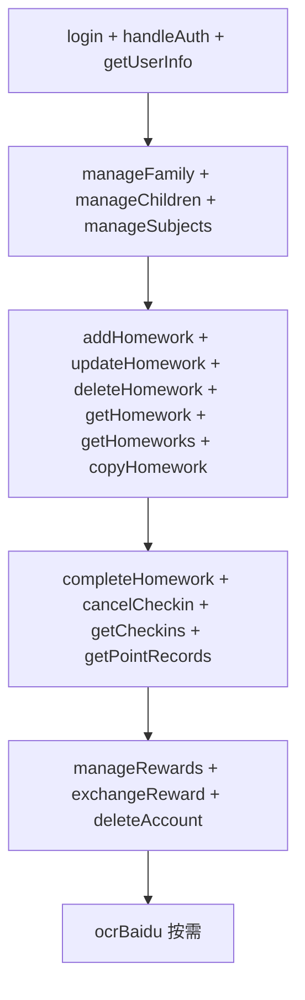

# 部署指南

本文档介绍如何将 DoJournal（作业打卡）部署到微信小程序平台，包括数据库初始化、云函数部署、OCR 配置与审核发布。

> 快速本地搭建见 [START.md](START.md)，架构说明见 [README.md](README.md)。

---

## 前置条件

- 已注册微信小程序账号并完成基本认证
- 已安装[微信开发者工具](https://developers.weixin.qq.com/miniprogram/dev/devtools/download.html)
- 已 Fork / Clone 本项目

---

## 一、小程序账号配置

### 1.1 登录微信公众平台

访问 https://mp.weixin.qq.com/ ，使用管理员账号登录。

### 1.2 基本信息

1. 设置 → 基本设置
2. 填写小程序名称（如：作业打卡）
3. 上传图标（512×512）
4. 填写简介
5. 服务类目建议：**教育 → 在线教育** 或 **工具 → 效率**

### 1.3 服务器域名

使用微信云开发，**无需**配置服务器域名。

### 1.4 隐私与协议

项目已包含：

- [pages/privacy-policy](pages/privacy-policy) — 隐私政策
- [pages/service-agreement](pages/service-agreement) — 服务协议

在微信公众平台 → 设置 → 服务内容声明 中配置隐私保护指引，并在审核时说明数据存储于微信云开发。

---

## 二、项目配置

### 2.1 AppID

编辑 [project.config.json](project.config.json)：

```json
{
  "appid": "你的小程序AppID"
}
```

### 2.2 云开发环境 ID

编辑 [app.js](app.js)：

```javascript
wx.cloud.init({
  env: 'your-env-id',
  traceUser: true
});
```

### 2.3 开通云开发

1. 微信开发者工具 → 「云开发」→ 「开通」
2. 选择按量计费（含免费额度）
3. 创建环境，记录环境 ID

---

## 三、数据库初始化

### 3.1 创建集合

在云开发控制台 → 数据库，创建以下集合：

| 集合 | 必填 | 说明 |
|------|:----:|------|
| `users` | ✅ | 用户；支持同 OpenID 多 account |
| `families` | ✅ | 家庭；嵌入 members、children |
| `homework` | ✅ | 作业 |
| `checkins` | ✅ | 打卡记录 |
| `point_records` | ✅ | 积分流水 |
| `appConfig` | ✅ | 注册开关、管理员配置 |
| `registration_invitations` | ✅ | 注册邀请码 |
| `family_invitations` | ✅ | 家庭邀请码 |
| `violations` | 可选 | 违规规则（pages/violations 使用） |
| `violationRecords` | 可选 | 扣分记录 |

**已废弃，请勿创建：**

- `rewards` — 奖励已嵌入 `users.children[]` / `families.children[]`
- `exchange_records` — 已改用 `point_records`

完整字段说明见 [database/init.js](database/init.js)。

### 3.2 权限设置

每个集合：**所有用户可读，仅创建者可写**

业务权限在云函数层通过 [shared/cloud-permissions/permissions.js](shared/cloud-permissions/permissions.js) 校验。

### 3.3 索引建议

在云开发控制台 → 数据库 → 索引管理 中添加：

**homework**

| 字段 | 排序 |
|------|------|
| `_openid` | 升序 |
| `childId` | 升序 |
| `homeworkDate` | 升序 |
| `recurringBatchId` | 升序 |
| `createTime` | 降序 |

**users**

| 字段 | 排序 |
|------|------|
| `_openid` | 升序 |
| `account` | 升序 |

**checkins**

| 字段 | 排序 |
|------|------|
| `homeworkId` | 升序 |
| `checkinDate` | 升序 |
| `_openid` | 升序 |

**point_records**

| 字段 | 排序 |
|------|------|
| `_openid` | 升序 |
| `childId` | 升序 |
| `createTime` | 降序 |

**appConfig**

| 字段 | 排序 |
|------|------|
| `key` | 升序 |

**family_invitations / registration_invitations**

| 字段 | 排序 |
|------|------|
| `code` | 升序 |

### 3.4 初始化 appConfig（可选）

**关闭开放注册时**，需配置管理员。在 `appConfig` 集合添加：

```json
{
  "key": "adminAccounts",
  "value": [
    { "openid": "管理员OpenID", "account": "账号标识" }
  ]
}
```

**注册开关**（可选，默认允许注册）：

```json
{
  "key": "registrationEnabled",
  "value": true
}
```

首次登录后在 `users` 集合查看 `_openid`。

### 3.5 奖励数据

奖励不再使用独立集合。通过小程序「积分」页添加，或写入孩子记录的 `rewards` 数组。示例见 [database/init.js](database/init.js)。

---

## 四、云函数部署

### 4.1 部署方式

在微信开发者工具中，右键 `cloudfunctions/<name>` → **上传并部署：云端安装依赖**。

也可在终端进入云函数目录执行 `npm install` 后再部署。

### 4.2 部署顺序



### 4.3 完整清单

| 云函数 | 必部署 |
|--------|:------:|
| login | ✅ |
| handleAuth | ✅ |
| getUserInfo | ✅ |
| manageFamily | ✅ |
| manageChildren | ✅ |
| manageSubjects | ✅ |
| addHomework | ✅ |
| updateHomework | ✅ |
| deleteHomework | ✅ |
| getHomework | ✅ |
| getHomeworks | ✅ |
| copyHomework | ✅ |
| completeHomework | ✅ |
| cancelCheckin | ✅ |
| getCheckins | ✅ |
| getPointRecords | ✅ |
| manageRewards | ✅ |
| exchangeReward | ✅ |
| deleteAccount | ✅ |
| ocrBaidu | 按需 |
| generateRecurringTasks | 可选 |
| ocrGeneral | 否 |
| checkinHomework | 否 |
| getPhoneNumber | 否 |

### 4.4 OCR 环境变量

云开发控制台 → 云函数 → `ocrBaidu` → 配置 → 环境变量：

| 变量 | 说明 |
|------|------|
| `BAIDU_OCR_API_KEY` | 百度 OCR API Key |
| `BAIDU_OCR_SECRET_KEY` | 百度 OCR Secret Key |

配置步骤：[BAIDU_OCR_SETUP.md](BAIDU_OCR_SETUP.md)

若 OCR 超时，参考 [CLOUD_FUNCTION_TIMEOUT.md](CLOUD_FUNCTION_TIMEOUT.md) 将超时调至 20 秒。

### 4.5 定时触发器（可选）

当前版本在 `addHomework` 创建周期作业时已预生成全部日期，`generateRecurringTasks` 一般**不需要**启用。

若仍要配置：

1. 云开发控制台 → 云函数 → `generateRecurringTasks`
2. 触发器 → 添加触发器
3. Cron：`0 0 0 * * * *`（每天 00:00）

### 4.6 权限模块同步

修改 [shared/cloud-permissions/permissions.js](shared/cloud-permissions/permissions.js) 后，需复制到各云函数的 `permissions.js` 并重新部署。详见 [CONTRIBUTING.md](CONTRIBUTING.md)。

---

## 五、上传与发布

### 5.1 本地验证

1. 真机调试完整走通：登录 → 家庭 → 添加作业 → 打卡 → 兑换
2. 参考 [TESTING.md](TESTING.md) 测试清单

### 5.2 上传代码

1. 微信开发者工具 → 右上角「上传」
2. 版本号（如 1.0.0）
3. 备注说明

### 5.3 体验版

1. 微信公众平台 → 管理 → 版本管理 → 体验版
2. 添加体验成员微信号
3. 扫码测试

### 5.4 提交审核

1. 开发版本 → 提交审核
2. 功能页面：首页、积分、我的、登录、添加作业、打卡
3. 提供测试账号（若关闭了开放注册，需提供可用账号或邀请码）
4. 说明使用了云开发存储用户作业与打卡数据

### 5.5 正式发布

审核通过 → 审核版本 → 发布

---

## 六、资源准备

### TabBar

当前 [app.json](app.json) 使用文字 Tab（首页 / 积分 / 我的），无图标配置。若需图标，在 `app.json` 的 `tabBar.list` 中添加 `iconPath` / `selectedIconPath`（建议 81×81 PNG）。

### 其他图片

- 默认头像、奖励占位图等放在 `images/` 目录

---

## 七、测试清单

- [ ] 注册 / 登录
- [ ] 创建家庭 / 加入家庭
- [ ] 添加 / 切换孩子
- [ ] 管理科目
- [ ] 手动添加作业
- [ ] 周期作业（创建、编辑当天/全部、删除当天/全部）
- [ ] 聊天 / 相册导入（OCR）
- [ ] 作业打卡与取消打卡
- [ ] 积分计算与流水
- [ ] 奖励添加与兑换
- [ ] 家庭成员权限（只读、单项权限）
- [ ] 分享海报生成与保存
- [ ] 隐私政策 / 服务协议页面可访问

---

## 八、监控与维护

### 云开发用量

定期查看：数据库容量、云函数调用次数、存储空间、CDN 流量。

### 日志

云开发控制台 → 云函数 → 选择函数 → 日志 / 监控

### 数据备份

数据库 → 选择集合 → 导入/导出 → 导出 JSON

---

## 九、常见问题

### 云函数不存在

确认函数已部署且名称与前端 `wx.cloud.callFunction({ name })` 一致。

### 数据库权限错误

集合权限设为「所有用户可读，仅创建者可写」。

### OCR 失败

检查 `ocrBaidu` 部署、环境变量、超时配置。

### 审核被拒

常见原因：缺少隐私政策、类目不符、测试账号不可用。确保 `privacy-policy` 和 `service-agreement` 页面可正常打开。

---

## 参考链接

- [微信小程序官方文档](https://developers.weixin.qq.com/miniprogram/dev/framework/)
- [云开发官方文档](https://developers.weixin.qq.com/miniprogram/dev/wxcloud/basis/getting-started.html)
- [项目 README](README.md)
- [快速开始](START.md)
