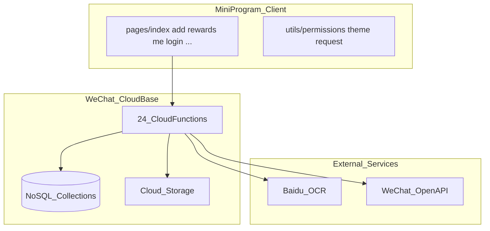
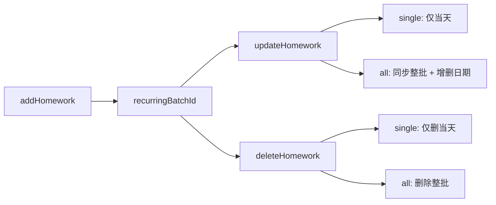

# DoJournal / 作业打卡

[](LICENSE)
[](https://developers.weixin.qq.com/miniprogram/dev/framework/)

> A WeChat Mini Program for children's homework check-in, points, and family collaboration.
>
> 面向家庭的儿童作业打卡小程序：管理作业、打卡积分、奖励兑换、多孩子协作。

### 在线体验

本项目已有**正式部署并在运行使用**的实例：

| 项目 | 说明 |
|------|------|
| 微信小程序名称 | **知行纪打卡** |
| 使用方式 | 在微信中搜索「知行纪打卡」打开小程序 |
| 注册说明 | 当前为**邀请码注册**，新用户需获取邀请码后方可注册使用 |

> 自行 Fork 部署时，可在 [DEPLOYMENT.md](DEPLOYMENT.md) 中配置 `appConfig.registrationEnabled` 与邀请码策略，决定是否开放注册。

---

## 项目简介

DoJournal（作业打卡）帮助家长记录和管理孩子的学习任务，通过积分与奖励机制激励孩子完成作业。支持多孩子、家庭成员协作、细粒度权限控制，以及聊天/相册导入与 OCR 识别。

### 核心功能

| 模块 | 功能 |
|------|------|
| 作业管理 | 手动添加、聊天/相册导入、OCR 识别、按科目分类、复制作业 |
| 周期作业 | 按星期重复、按次数或截止日期结束；支持「仅改当天 / 改整个周期」 |
| 打卡积分 | 上传完成凭证、评分、连续打卡奖励、取消打卡 |
| 积分系统 | 积分流水、奖励兑换、违规扣分 |
| 家庭协作 | 创建/加入家庭、邀请码、成员角色与细粒度权限 |
| 多孩子 | 每个孩子独立科目、作业、积分、奖励 |
| 分享 | Canvas 2D 生成打卡海报，保存到相册 |

> 截图占位：可在 `images/screenshots/` 目录补充首页、打卡、积分页截图后替换此处。

---

## 技术框架

### 架构总览



### 技术栈

| 层级 | 技术 |
|------|------|
| 客户端 | 微信小程序原生（WXML / WXSS / JS），基础库 3.x |
| 后端 | 微信云开发（云函数 + 云数据库 + 云存储） |
| 权限 | [utils/permissions.js](utils/permissions.js) + 各云函数 `permissions.js` 副本 |
| OCR | [cloudfunctions/ocrBaidu](cloudfunctions/ocrBaidu)（需配置环境变量） |
| 分享海报 | Canvas 2D，[pages/share](pages/share) |

### 数据流


### 周期作业生命周期



---

## 系统模块

### 认证与账号

- 云函数：`login`、`handleAuth`、`getUserInfo`
- 页面：[pages/login](pages/login)、[pages/accounts](pages/accounts)
- 支持同一微信 OpenID 下多账号；家庭管理员可在会话内切换账号

### 家庭与孩子

- 云函数：`manageFamily`、`manageChildren`
- 页面：[pages/me](pages/me)、[pages/index](pages/index)
- 家庭共享孩子数据；成员可配置只读与 9 项细粒度权限

### 作业管理

- 云函数：`addHomework`、`updateHomework`、`deleteHomework`、`getHomework`、`getHomeworks`、`copyHomework`
- 页面：[pages/add](pages/add)、[pages/index](pages/index)
- 周期作业通过 `recurringBatchId` 关联同批记录

### 打卡与积分

- 云函数：`completeHomework`、`cancelCheckin`、`getCheckins`、`getPointRecords`
- 页面：[pages/checkin](pages/checkin)、[pages/index](pages/index)
- 打卡写入 `checkins` 与 `point_records`，更新孩子积分

### 奖励与违规

- 云函数：`manageRewards`、`exchangeReward`
- 页面：[pages/rewards](pages/rewards)
- 奖励/惩罚规则嵌入 `users.children[]` 或 `families.children[]`，非独立集合

### 科目管理

- 云函数：`manageSubjects`
- 在首页与添加页管理每个孩子各自的科目列表

### OCR 导入

- 云函数：`ocrBaidu`（当前主路径）
- 配置见 [BAIDU_OCR_SETUP.md](BAIDU_OCR_SETUP.md)，使用说明见 [IMPORT_GUIDE.md](IMPORT_GUIDE.md)

---

## 云函数清单（24 个）

| 云函数 | 用途 | 必部署 | 环境变量 |
|--------|------|:------:|----------|
| `login` | 微信登录、创建用户 | ✅ | — |
| `handleAuth` | 注册、密码登录、邀请码、管理员配置 | ✅ | — |
| `getUserInfo` | 获取/更新用户信息 | ✅ | — |
| `manageFamily` | 家庭 CRUD、成员、邀请、权限 | ✅ | — |
| `manageChildren` | 孩子增删改、切换 | ✅ | — |
| `manageSubjects` | 科目管理 | ✅ | — |
| `addHomework` | 添加作业（含周期批量创建） | ✅ | — |
| `updateHomework` | 编辑作业（含周期同步） | ✅ | — |
| `deleteHomework` | 删除作业（当天/整批） | ✅ | — |
| `getHomework` | 获取单条作业 | ✅ | — |
| `getHomeworks` | 列表查询 | ✅ | — |
| `copyHomework` | 复制作业到其他日期 | ✅ | — |
| `completeHomework` | 打卡、计分 | ✅ | — |
| `cancelCheckin` | 取消打卡、退还积分 | ✅ | — |
| `getCheckins` | 查询打卡记录 | ✅ | — |
| `getPointRecords` | 积分流水 | ✅ | — |
| `manageRewards` | 奖励/惩罚 CRUD、执行扣分 | ✅ | — |
| `exchangeReward` | 积分兑换奖励 | ✅ | — |
| `deleteAccount` | 注销账号 | ✅ | — |
| `ocrBaidu` | 百度 OCR 识别 | 按需 | `BAIDU_OCR_API_KEY`、`BAIDU_OCR_SECRET_KEY` |
| `generateRecurringTasks` | 定时生成周期作业 | 可选 | — |
| `ocrGeneral` | 阿里云 OCR（备用） | 否 | `ALIYUN_OCR_ACCESS_KEY_ID`、`ALIYUN_OCR_ACCESS_KEY_SECRET` |
| `checkinHomework` | 旧版打卡实现 | 否 | — |
| `getPhoneNumber` | 解析手机号 | 否 | — |

> `generateRecurringTasks` 为可选定时任务；当前版本在 `addHomework` 创建周期作业时已预生成全部日期，一般无需启用。

---

## 快速开始

### 1. Fork 并配置

```bash
git clone https://github.com/your-username/DoJournal.git
cd DoJournal
```

修改两处配置（**仓库内的 AppID / 环境 ID 仅为示例，fork 后必须替换**）：

| 文件 | 字段 | 改为 |
|------|------|------|
| [project.config.json](project.config.json) | `appid` | 你的小程序 AppID |
| [app.js](app.js) | `wx.cloud.init({ env })` | 你的云开发环境 ID |

### 2. 开通云开发

1. 用[微信开发者工具](https://developers.weixin.qq.com/miniprogram/dev/devtools/download.html)打开项目
2. 点击「云开发」→ 开通（免费版即可）
3. 创建环境，将环境 ID 填入 `app.js`

### 3. 初始化数据库

在云开发控制台创建集合（详见 [DEPLOYMENT.md](DEPLOYMENT.md) 第三节）：

`users` · `families` · `homework` · `checkins` · `point_records` · `appConfig` · `registration_invitations` · `family_invitations`

数据模型详见 [database/init.js](database/init.js)。

### 4. 部署云函数

在微信开发者工具中，右键 `cloudfunctions` 下各云函数文件夹 → **上传并部署：云端安装依赖**。

建议顺序：先部署 `login`、`handleAuth`，再部署其余必部署函数（见上表）。

### 5. 配置 OCR（可选）

在云开发控制台 → 云函数 → `ocrBaidu` → 配置 → 环境变量，填入百度 OCR 密钥。详见 [BAIDU_OCR_SETUP.md](BAIDU_OCR_SETUP.md)。

### 6. 编译运行

点击「编译」，推荐使用「真机调试」体验完整功能。

完整分步指南：[START.md](START.md)

---

## 目录结构

```
DoJournal/
├── app.js / app.json / app.wxss     # 小程序入口与全局配置
├── project.config.json              # 项目配置（AppID）
├── cloudfunctions/                  # 24 个云函数
│   ├── login/
│   ├── handleAuth/
│   ├── manageFamily/
│   ├── addHomework/
│   ├── ocrBaidu/
│   └── ...
├── pages/                           # 页面
│   ├── index/                       # 首页（日历、作业列表）
│   ├── add/                         # 添加/编辑作业
│   ├── checkin/                     # 打卡
│   ├── rewards/                     # 积分与奖励
│   ├── me/                          # 我的（家庭、设置）
│   ├── login/                       # 登录注册
│   ├── accounts/                    # 账号切换
│   └── share/                       # 分享海报
├── utils/                           # 工具（permissions、theme、request）
├── shared/cloud-permissions/        # 权限模块源码（需同步到各云函数）
├── database/init.js                 # 数据模型参考
├── styles/                          # 全局样式（含深色模式）
└── docs & guides                    # 见下方文档索引
```

---

## 开发与二次开发

### 修改前端页面

保存 `.js` / `.wxml` / `.wxss` 文件后，开发者工具会自动刷新预览。

### 修改云函数

1. 编辑 `cloudfunctions/<name>/index.js`
2. 右键该文件夹 → **上传并部署：云端安装依赖**
3. 在云开发控制台查看日志确认

### 修改权限定义

1. 编辑 [shared/cloud-permissions/permissions.js](shared/cloud-permissions/permissions.js)
2. 同步到各云函数目录：

```bash
cp shared/cloud-permissions/permissions.js cloudfunctions/manageFamily/permissions.js
# 对所有含 permissions.js 的云函数重复
```

3. 重新部署相关云函数

### 常见扩展点

| 需求 | 建议修改位置 |
|------|-------------|
| 积分规则 | `cloudfunctions/completeHomework/index.js` |
| 新增权限项 | `shared/cloud-permissions/permissions.js` + 前端拦截 |
| 更换 OCR 提供商 | `pages/add/add.js` 调用处 + 对应云函数 |
| 自定义注册流程 | `cloudfunctions/handleAuth/index.js` |

更多贡献说明见 [CONTRIBUTING.md](CONTRIBUTING.md)。

---

## 操作指南（使用者）

### 界面导航

底部 Tab：**首页** · **积分** · **我的**

- 添加作业：首页选择日期 → 点击科目 → 添加/编辑
- 打卡：首页点击待完成作业
- 奖励兑换：积分 Tab
- 家庭与权限：我的 Tab

### 周期作业

- **保存**：周期作业会提示「仅修改当天作业」或「修改所有周期作业」
- **删除**：同样支持「仅删除当天」或「删除所有周期作业」
- **改周期**（如增删星期四）：选择「修改所有周期作业」后，系统自动增删对应日期的作业记录

### 家庭与权限

1. 「我的」→ 创建家庭或输入邀请码加入
2. 家庭创建者可邀请成员、设置只读或细粒度权限
3. 家庭管理员可在「账号管理」中切换同 OpenID 下的账号

---

## 文档索引

| 文档 | 内容 |
|------|------|
| [START.md](START.md) | 5 分钟从零搭建 |
| [DEPLOYMENT.md](DEPLOYMENT.md) | 数据库、云函数、审核发布 |
| [database/init.js](database/init.js) | 数据模型与索引 |
| [TESTING.md](TESTING.md) | 测试清单 |
| [IMPORT_GUIDE.md](IMPORT_GUIDE.md) | 聊天/相册导入 |
| [BAIDU_OCR_SETUP.md](BAIDU_OCR_SETUP.md) | OCR 配置（主路径） |
| [CLOUD_FUNCTION_TIMEOUT.md](CLOUD_FUNCTION_TIMEOUT.md) | OCR 超时调优 |
| [CONTRIBUTING.md](CONTRIBUTING.md) | 贡献指南 |

### OCR 相关文档（备用路径）

- [TENCENT_OCR_SETUP.md](TENCENT_OCR_SETUP.md)
- [ALIYUN_OCR_SETUP.md](ALIYUN_OCR_SETUP.md)
- [ALIYUN_OCR_QUICKSTART.md](ALIYUN_OCR_QUICKSTART.md)

当前小程序 UI 默认调用 `ocrBaidu`，其余为历史/备用方案。

---

## 云开发免费版限制

| 资源 | 免费额度 |
|------|---------|
| 数据库 | 2 GB |
| 云存储 | 5 GB |
| CDN 流量 | 5 GB/月 |
| 云函数调用 | 15 万次/月 |

---

## 已实现 vs 欢迎贡献

**已实现：** 多孩子、家庭协作、细粒度权限、OCR 导入、周期作业批量管理、深色模式、账号切换

**欢迎贡献的方向：**

- 数据统计与图表
- 成就系统
- 英文国际化
- 单元测试与 CI
- 截图与演示文档

---

## 许可证

[MIT License](LICENSE)

## 反馈

欢迎提交 [Issue](https://github.com/your-username/DoJournal/issues) 或 Pull Request。
